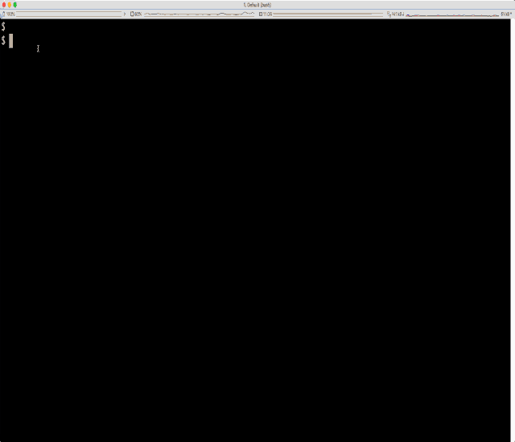
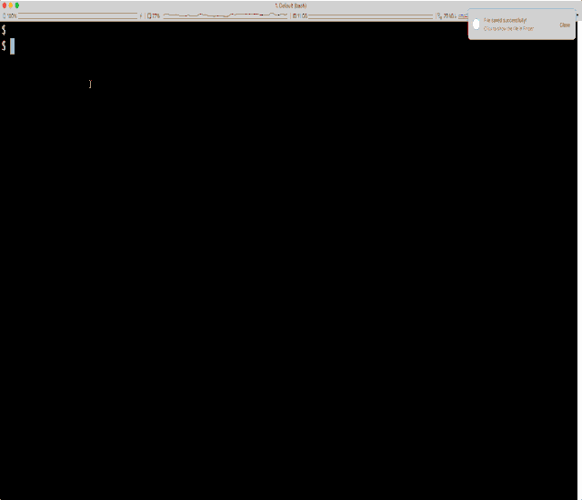
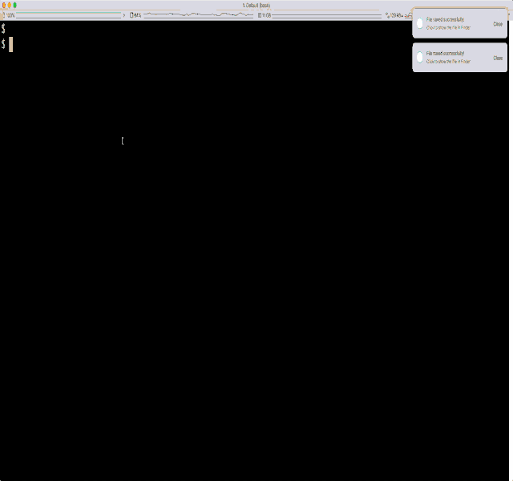
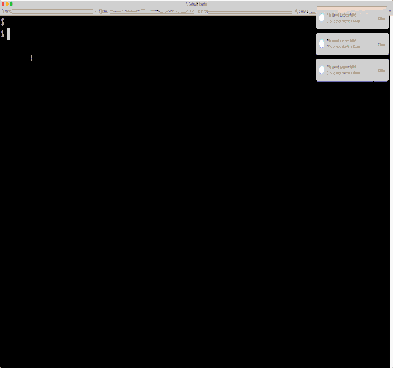
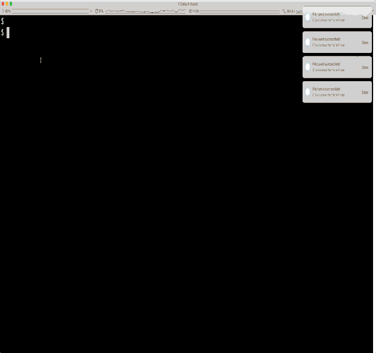

# COVID-19 CLI

This package provides a command line interface for presenting current COVID-19 statistics. 
Data is sourced from Johns Hopkins University Center for Systems Science and Engineering (JHU CSSE). 
Also, supported by ESRI Living Atlas Team and the Johns Hopkins University Applied Physics Lab (JHU APL).
https://systems.jhu.edu/research/public-health/ncov/
## Usage
```
Usage: corona.py [OPTIONS]

  Command line interface for COVID-19 statistics. Data sourced from Johns
  Hopkins University Center for Systems Science and Engineering (JHU CSSE).
  Also, Supported by ESRI Living Atlas Team and the Johns Hopkins University
  Applied Physics Lab (JHU APL).

Options:
  --country TEXT  filter by country
  --region TEXT   filter by region (requires country)
  --summary       print summary statistics
  --date TEXT     filter by date YYYY-MM-DD
  --plot          plot trends
  --reload        reload all data
  --help          Show this message and exit
```

### World wide
[](./../../)

### Country details
[](./../../)

### Country,Region Details
[](./../../)

### Plots - World wide summary 
[](./../../)

### Plots - Country
[](./../../)

### Plots - Country, Region
[](./../../)

## Installation

```
$ git clone https://github.com/kartikq/corona.git 

$ git submodule init

$ git submodule update

$ pip install -r requirements.txt

```

## Loading the case information

Post installation peform a one time import
```
$ ./corona.py --reload
```

Set up hourly job to import latest data when available
```
$ nohup ./import_job.py &
```

## License & Conduct
* MIT © Kartik Vishwanath
* [Code of Conduct](code-of-conduct.md)

### Sources
1. Johns Hopkins University Center for Systems Science and Engineering - https://systems.jhu.edu/research/public-health/ncov/